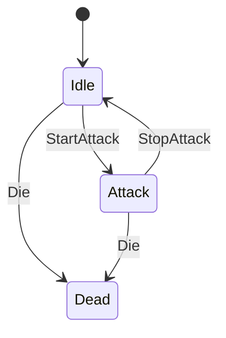
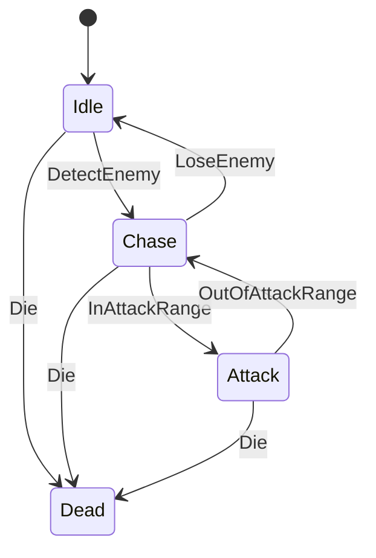
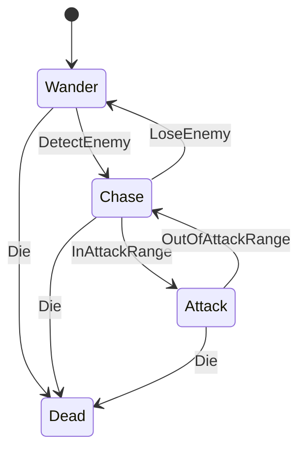

# 유닛 FSM 다이어그램

유닛 종류별 유한 상태 기계(FSM) 전이 구조를 정리한 문서.

---

## 1. 플레이어 FSM (`PlayerFSM`)

**초기 상태:** Idle

| 트리거 | 발생 조건 |
|---|---|
| `StartAttack` | `OnAttackFired` 이벤트 발생 (CombatSystem이 공격 처리 후 호출) |
| `StopAttack` | 공격 쿨다운 완료 (`Combat.CanAttack == true`) |
| `Die` | HP ≤ 0 (Health.OnDeath) |

> **이동 동작:** Move 상태 없음. Idle·Attack 모두에서 이동 가능.
> - `PlayerIdleState.OnUpdate()` — 입력 있으면 이동 + move 애님, 없으면 정지 + idle 애님
> - `PlayerAttackState.OnUpdate()` — 입력 있으면 이동; 쿨다운 완료 시 StopAttack
> - Dead 상태에서만 이동 차단

---

## 2. 스쿼드 멤버 FSM (`SquadMemberFSM`)

**초기 상태:** Idle
**대상:** 플레이어 스쿼드에 소속된 테이밍된 몬스터

| 트리거 | 발생 조건 |
|---|---|
| `StartAttack` | SpatialGrid 탐색 결과 공격 범위 내 적군 존재 |
| `StopAttack` | 공격 범위 내 적군 없음 |
| `Die` | HP ≤ 0 (Health.OnDeath) |

> **이동 동작:** Move 상태 없음. Idle·Attack 모두에서 이동 가능.
> - `SquadMemberIdleState.OnUpdate()` — FlockBehavior 방향으로 이동; 애님은 이동 여부로 전환
> - `SquadMemberAttackState.OnUpdate()` — 적 범위 내 공격 + FlockBehavior 방향으로 이동 병행
> - Dead 상태에서만 이동 차단
>
> **참고:** 실제 데미지 판정은 `CombatSystem`이 독립적으로 처리한다.

---

## 3. 몬스터 스탠드얼론 FSM (`MonsterStandaloneFSM`)

**초기 상태:** Idle
**대상:** 스쿼드에 소속되지 않은 단독 몬스터

| 트리거 | 발생 조건 |
|---|---|
| `DetectEnemy` | SpatialGrid 탐색 결과 감지 범위 내 적군 존재 |
| `LoseEnemy` | 감지 범위 내 적군 없음 |
| `InAttackRange` | 가장 가까운 적이 공격 범위 이내 |
| `OutOfAttackRange` | 공격 범위 내 적군 없음 |
| `Die` | HP ≤ 0 (Health.OnDeath) |

> **Attack 이동:** Attack 상태에서도 가장 가까운 적을 향해 이동한다.

---

## 4. 몬스터 리더 FSM (`MonsterLeaderFSM`)

**초기 상태:** Wander
**대상:** MonsterSquad의 리더로 승격된 몬스터

> 스탠드얼론 FSM과 달리 Idle 대신 **Wander** 상태에서 시작하며,
> 적을 놓쳤을 때도 Idle이 아닌 Wander로 복귀한다.
> ObstacleGrid를 활용한 장애물 우회 이동을 지원한다.

| 트리거 | 발생 조건 |
|---|---|
| `DetectEnemy` | SpatialGrid 탐색 결과 감지 범위 내 적군 존재 |
| `LoseEnemy` | 감지 범위 내 적군 없음 |
| `InAttackRange` | 가장 가까운 적이 공격 범위 이내 |
| `OutOfAttackRange` | 공격 범위 내 적군 없음 |
| `Die` | HP ≤ 0 (Health.OnDeath) |

> **Attack 이동:** Attack 상태에서도 가장 가까운 적을 향해 이동한다.

---

## FSM 비교 요약

| FSM | 초기 상태 | 상태 수 | 이동 방식 | Attack 진입 조건 | Attack 탈출 조건 |
|---|---|---|---|---|---|
| `PlayerFSM` | Idle | 3 (Idle/Attack/Dead) | Idle·Attack 모두 입력 기반 이동 | `OnAttackFired` 이벤트 | 공격 쿨다운 완료 |
| `SquadMemberFSM` | Idle | 3 (Idle/Attack/Dead) | Idle·Attack 모두 FlockBehavior 이동 | 공격 범위 내 적 탐지 | 공격 범위 내 적 없음 |
| `MonsterStandaloneFSM` | Idle | 4 (Idle/Chase/Attack/Dead) | Chase·Attack 모두 적 추적 이동 | Chase 중 공격 범위 진입 | 공격 범위 내 적 없음 |
| `MonsterLeaderFSM` | Wander | 4 (Wander/Chase/Attack/Dead) | Chase·Attack 모두 적 추적 이동 | Chase 중 공격 범위 진입 | 공격 범위 내 적 없음 |
