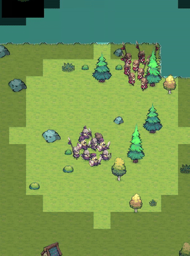

# Wild Tamer Like

> **NavMesh 없이 직접 구현한 군집 알고리즘(Boid) 기반 2D 쿼터뷰 테이밍 RPG**
> Unity Job System + Burst Compiler로 200+ 유닛을 0.1ms에 처리 — 4일, AI 협업 워크플로우

<p align="center">
  
  
</p>

<p align="center">
  <a href="https://youtube.com/shorts/zjLLc0lxeq0">▶ 전체 플레이 영상 보기</a>
</p>

---

## 핵심 수치

| 지표 | 수치 |
|:---|:---|
| 군집 동시 처리 | 200+ 유닛 |
| Flock 계산 시간 | 0.1ms 이내 |
| 최적화 성능 향상 | 단일 스레드 대비 8~16× |
| SpatialGrid 쿼리 절감 | 85% |
| 200+ 유닛 렌더링 | Set Pass Call 70~150 |

---

## 코어 루프

```
탐험 → 전투 → 테이밍 → 부대 확장 → 탐험
```

플레이어가 월드를 탐험하며 몬스터와 전투하고, 처치한 몬스터를 테이밍해 부대원으로 편입합니다.
부대가 커질수록 더 강한 적과 보스에 도전할 수 있는 순환 구조입니다.

---

## 군집 알고리즘 — 이 프로젝트의 핵심

### 왜 NavMesh를 쓰지 않았나?

NavMesh는 개별 유닛의 경로를 계산하는 데 최적화되어 있습니다. 하지만 군집(flock)은 개별 경로가 아니라 **집단의 상호작용**으로 움직입니다. Craig Reynolds의 Boid 알고리즘을 직접 구현하면 군집의 모든 행동 파라미터를 ScriptableObject로 완전히 제어할 수 있습니다. 가중치를 런타임에 조정하며 군집 특성을 튜닝할 수 있는 것은 NavMesh로는 얻을 수 없는 자유도입니다.

### 5가지 힘 벡터

```
                        ┌── Separation (분리) ─── 이웃과 최소 거리 유지
                        │                         역제곱 법칙으로 가까울수록 강한 반발
                        │
                        ├── Cohesion (응집) ───── 이웃 무게중심 방향으로 이동
                        │
  최종 이동 벡터 = Σ ── ├── Alignment (정렬) ──── 이웃과 같은 방향으로 이동
                        │
                        ├── Follow (추종) ─────── 리더(플레이어) 방향으로 이동
                        │                         ArrivalRadius 이내 거리 비례 감속
                        │
                        └── Avoidance (회피) ──── ObstacleGrid 기반 장애물 회피
```

### sqrt 없는 역제곱 Separation

모든 거리 비교를 `sqrMagnitude`로 처리하여 sqrt 연산을 완전히 제거했습니다:

```csharp
separationSum += diff * ((sqrMinSep - sqrDist) / (sqrDist * sqrMinSep));
```

경계(`sqrDist == sqrMinSep`)에서 0, 거리 0에서 최대값 — 수학적으로 올바른 역제곱 감쇠를 sqrt 없이 구현합니다.

### Job System 병렬화 — 3단계 파이프라인

```
┌─────────────────────────────────────────────────────────────────┐
│ 1. Main Thread     Transform → NativeArray 복사                  │
├─────────────────────────────────────────────────────────────────┤
│ 2. Worker Threads  Separation + Cohesion + Follow 병렬 계산      │
│                    FlockJob : IJobParallelFor + [BurstCompile]   │
│                    innerloopBatchCount: 8                        │
├─────────────────────────────────────────────────────────────────┤
│ 3. Main Thread     결과 적용 + Avoidance 후처리                   │
└─────────────────────────────────────────────────────────────────┘
```

`Allocator.Persistent`로 NativeArray를 재사용하고, 부대 크기 변경 시에만 재할당합니다.

**결과:** 200유닛 N²=40,000 연산을 **0.1ms 이내**, 단일 스레드 대비 **8~16배 향상**

---

## 성능 설계

### SpatialGrid — O(1) 공간 해시

전투 시스템의 적 탐지에 O(n²) 브루트포스 대신 공간 해시 그리드를 사용합니다.

**struct 생성 없는 `long` 비트 패킹:**

```csharp
private static long PackKey(int x, int y) => ((long)x << 32) | (uint)y;
```

**프레임 캐시:** 동일 `(cx, cy, range)` 쿼리 결과를 프레임 내 공유 → 200유닛 밀집 시 TryGetValue 호출 **85% 절감**
**코너 컬링:** 셀 간 AABB 최솟값 거리로 불필요한 셀 사전 배제

### 렌더링 — Set Pass Call 70~150 유지

- **SRP Batcher** 활성화 (URP)
- **SpriteAtlas** — 동일 텍스처 참조로 드로우 콜 합산
- **Custom Sort Axis** — Z 조작 없이 Y축 기준 깊이 정렬, 동적 배칭 유지
- 레이어별 sortingOrder 간격 1000 (`Water=0, Ground=1000, Unit=2000, Fog=3000`)

### GC 최적화

- LINQ 제거 → for 인덱스 루프
- Transform.position 프레임당 1회 캐싱
- `Facade.Pool`로 Instantiate/Destroy 완전 제거
- static 배열 재사용으로 매 호출 할당 제거

---

## 아키텍처

### Model-View 분리 — 테스트 가능한 구조

| 계층 | 특징 | 예시 |
|------|------|------|
| **Model** (순수 C#) | MonoBehaviour 의존 없음, 독립 테스트 가능 | `Player`, `Monster`, `SquadMember` |
| **View** (MonoBehaviour) | 렌더링·애니메이션·물리 전담 | `PlayerView`, `MonsterView` |

Model이 MonoBehaviour에 의존하지 않기 때문에 Unity 없이 NUnit으로 직접 테스트할 수 있습니다.

### Facade — 14개 서비스, 인터페이스 기반

외부 DI 프레임워크 없이, 정적 진입점 하나로 14개 서비스를 제공합니다. `Facade.Pool.Get<T>()` 한 줄로 의도를 파악할 수 있는 직관성이 목표였습니다. 모든 서비스는 인터페이스로 추상화되어 있어 구현체만 교체하면 동작합니다.

```
Facade
├── Logger · Json · Time · Data · DB · Pool · Loader
└── PageChanger · PopupManager · Coroutine · Sound · Escape · Scene · Transition
```

### FSM — 범용 제네릭 상태 머신

```csharp
StateMachine<TEntity, TEnumTrigger>
```

Player / Monster / Squad / Boss / Scene 전체에 동일한 FSM 프레임워크를 적용합니다.

### asmdef 기반 모듈화

```
Assembly-CSharp (Game)
  └─→ Base.Runtime           ← 외부 의존: UniTask, Newtonsoft.Json만
  └─→ FiniteStateMachine.Runtime
```

`Base` 모듈은 어떤 Unity 프로젝트에도 이식 가능합니다.

### 주요 디자인 패턴

| 패턴 | 적용 위치 |
|------|-----------|
| **Strategy** | 보스 공격 패턴 7종 (`IBossPattern`) |
| **Observer** | `Notifier` / `GlobalNotifier` 타입 기반 이벤트 |
| **Object Pool** | 엔티티, 이펙트 — GC 부하 제거 |
| **데이터 주도 설계** | 모든 게임 수치를 ScriptableObject로 테이블화 |

---

## 개발 방식

### 4일, AI 협업 워크플로우

혼자, 4일, AI 코딩 도구를 활용했습니다. 단순히 코드를 생성한 것이 아니라 **두 개의 AI CLI 세션을 역할로 분리**해서 운영했습니다:

- **구현 세션** — 기능 구현 담당
- **리뷰 세션** — 구현 세션이 만든 코드를 다른 컨텍스트로 리뷰

서로 다른 컨텍스트를 가진 세션이 상호 리뷰하는 방식으로, AI 코딩 특유의 품질 저하를 방지했습니다. 이 워크플로우를 유지하기 위해 코딩 컨벤션, 커밋 컨벤션, 6단계 개발 프로세스를 직접 정립하고 따랐습니다.

**결과:** 180개 C# 스크립트, 71개 설계 문서 — 프로덕션 수준의 코드 품질

### 6단계 개발 프로세스

```
컨셉(Concept) → 설계(Design) → 리뷰(Review) → 구현 계획(Plan) → 구현(Impl) → TRD
```

각 시스템마다 이 흐름을 따라 설계 문서부터 작성했습니다.

```
Assets/Docs/System/{시스템}/
├── concept.md              — 시스템 개요
├── design/design.md        — 아키텍처 설계
├── review/review.md        — 설계 리뷰
├── implementation_plan.md  — 구현 단계별 계획
└── trd_*.md                — 기술 참조 문서
```

---

## 기술 스택

| 카테고리 | 기술 | 설명 |
|---------|------|------|
| 엔진 | Unity 2022 LTS | 2D 쿼터뷰 RPG |
| 렌더링 | URP | SRP Batcher 활성화 |
| 병렬 처리 | Job System + Burst | 군집 계산 멀티스레드 + SIMD 병렬화 |
| 비동기 | UniTask | async/await 기반 비동기 처리 |
| 애니메이션 | DOTween | 트윈 기반 연출 |
| 직렬화 | Newtonsoft.Json | JSON 기반 데이터 직렬화 |
| 고성능 컬렉션 | Unity.Collections | NativeArray 등 Job System용 비관리 메모리 |
| 데이터 관리 | ScriptableObject | Inspector에서 밸런스 조정 가능한 데이터 테이블 |
| 테스트 | NUnit | Unity Test Framework 기반 유닛 테스트 |

---

## 테스트

Model이 순수 C#으로 설계되어 있어, asmdef로 분리된 테스트 프로젝트에서 NUnit으로 직접 테스트합니다.

| 테스트 대상 | 주요 테스트 항목 |
|------------|----------------|
| **Notifier** (Event Bus) | 구독/발행, 중복 구독, 순회 중 구독 해제 등 엣지 케이스 |
| **StateMachine** (FSM) | 상태 전이, 커맨드 실행, 초기 상태 설정 |
| **EnumLike** | 커스텀 열거형 유틸리티 |

---

## 프로젝트 구조

```
Assets/
├── Scripts/                    — C# 스크립트 127개
│   ├── 04.Game/
│   │   ├── 01.Entity/          — Player, Monster, Squad, Boss
│   │   ├── 02.System/          — Combat, Spatial, Squad, Map, VFX
│   │   └── 03.Data/            — ScriptableObject 데이터
│   └── ...
├── Modules/                    — asmdef 기반 독립 모듈 (53개 스크립트)
│   ├── Base/                   — 핵심 프레임워크
│   └── FiniteStateMachine/     — 범용 FSM
└── Docs/                       — 설계 문서 71개
```

---

## 에셋 크레딧

- **Tiny Swords** by Pixel Frog — [pixelfrog-assets.itch.io/tiny-swords](https://pixelfrog-assets.itch.io/tiny-swords)
